# 📞 Contact360 – Contact Management System  
A Spring Boot–based Contact Management Application using **Spring MVC, Thymeleaf, Spring Security, Hibernate/JPA, MySQL**, and **Bootstrap**.  
This app allows users to register, login, manage their personal contacts with full CRUD functionality, and now includes **Forgot/Change Password via Email OTP** and **Payment Gateway (Stripe Sandbox)**.

---

## ⭐ Features  

### 🔐 User Management
- User Registration  
- Secure Login (Spring Security)  
- Password Encryption  
- Forgot Password via Email OTP  
- Change Password  
- User Dashboard  

### 📇 Contact Management  
- Add New Contact  
- Edit Contact  
- Delete Contact  
- View All Contacts  
- Upload Contact Profile Images  

### 💳 Payment Gateway
- Stripe Sandbox Integration  
- View Payment Receipt  
- Save Payment Details  

---

## 🛠 Tools & Technologies  
- **Java 21**  
- **Spring Boot 3.5.6**  
- **Spring MVC**  
- **Thymeleaf**  
- **Spring Security**  
- **Spring Data JPA (Hibernate)**  
- **MySQL**  
- **Maven**  
- **Bootstrap**  
- **Custom CSS**  
- **JavaScript (Validation & UI Events)**  
- **JavaMail API** (For Email OTP)  
- **Stripe Java SDK** (For Payments)  

---

## 🏠 Dashboard  
User-specific dashboard showing quick stats and menu options.  
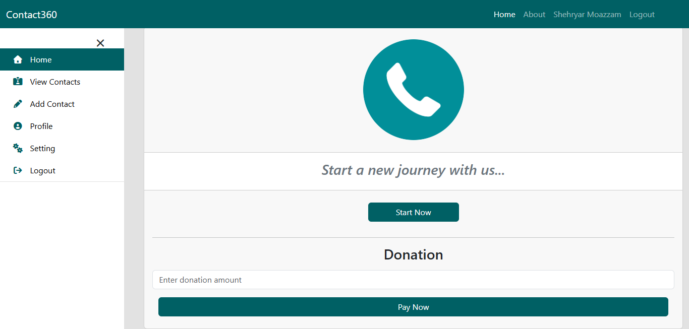

---

## 📝 User Registration (Sign Up)  
Users can create an account using this registration form.  
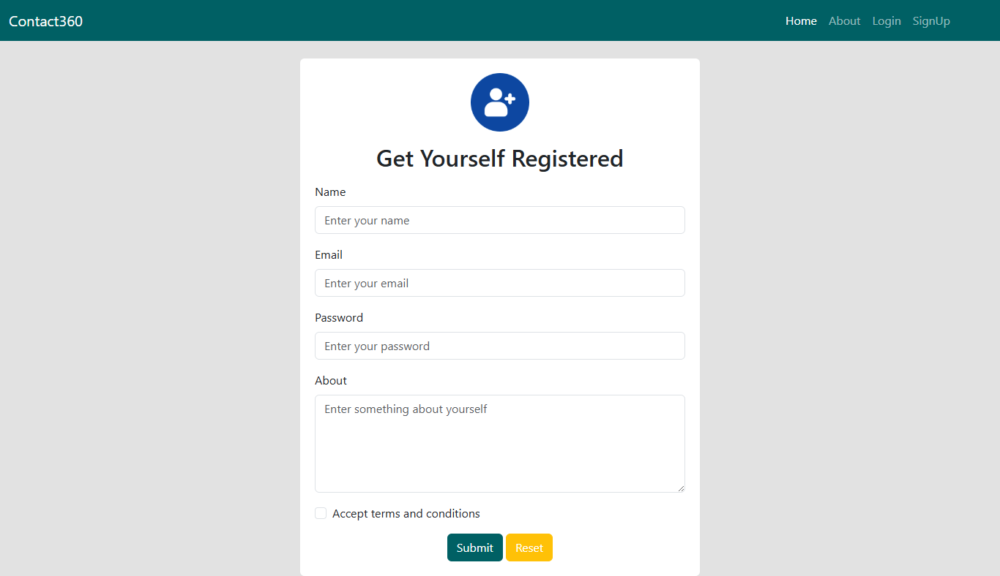

---

## 🔐 Login  
Secure login using Spring Security with validation.  
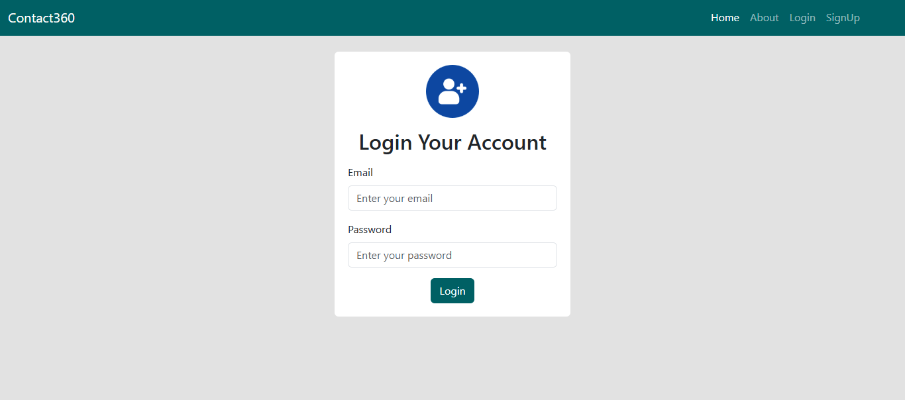

---

## 🔑 Forgot / Change Password  
Users can reset password using email OTP and change password after login.  

Forgot Password:
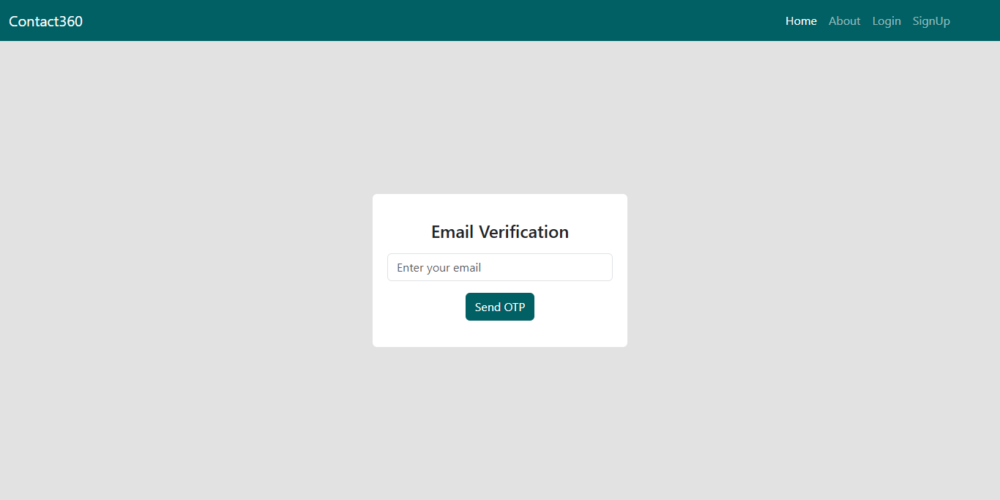
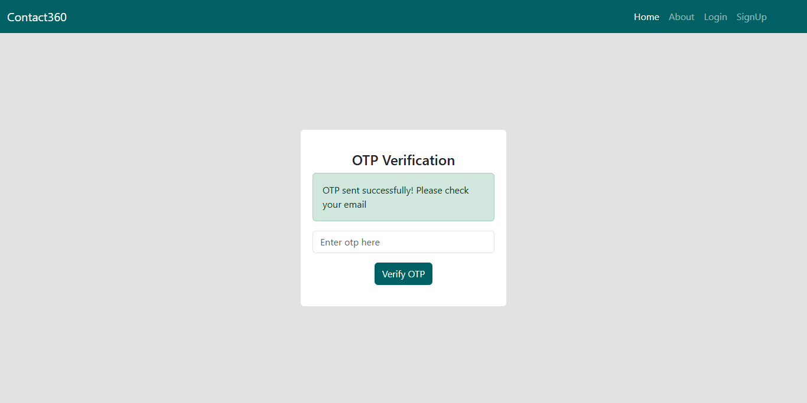

Change Password:
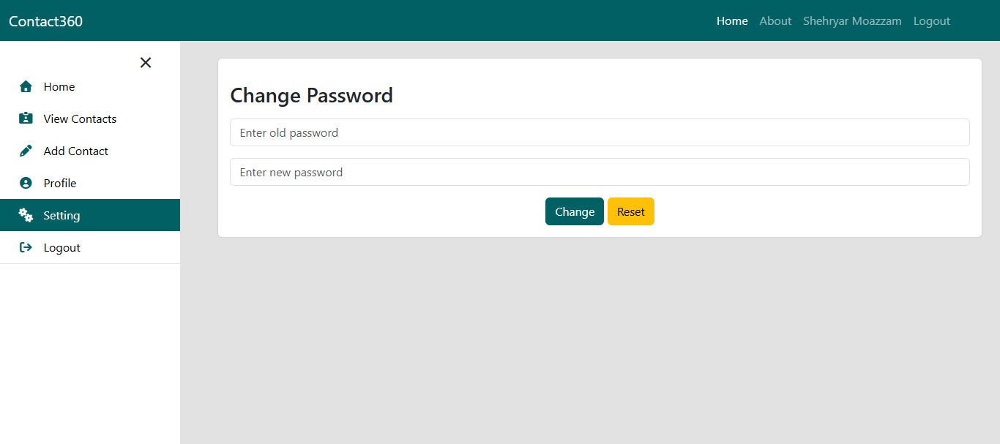

---

## 📋 View User Profile  
Displays user profile in table/card layout.  
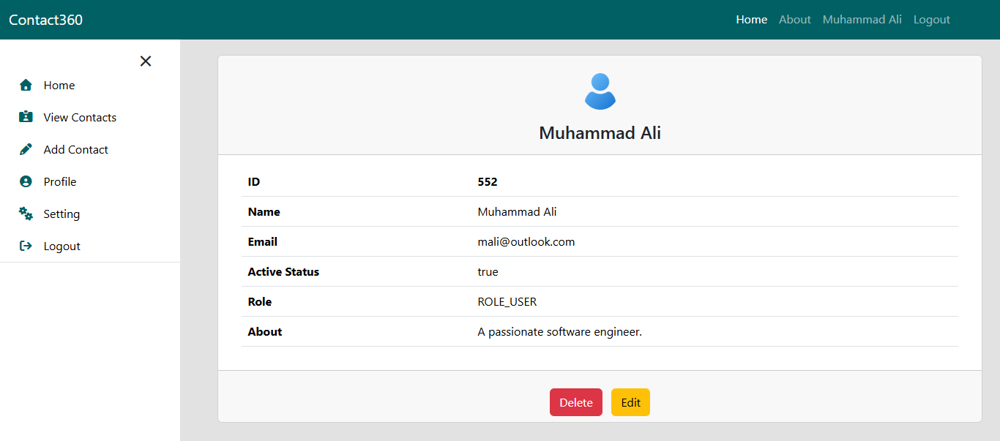

---

## ➕ Add New Contact  
Add a new contact with details like name, email, phone, and image.  
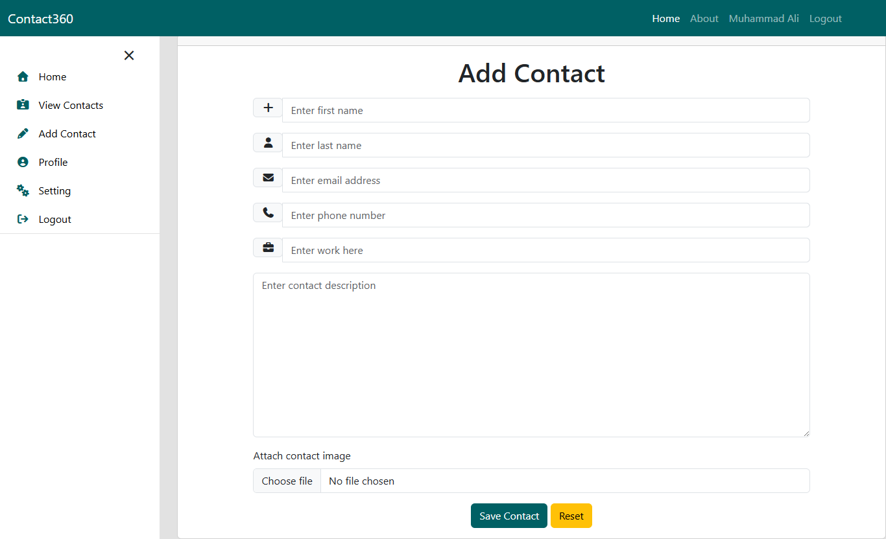

---

## 📋 View All Contacts (Pagination)
Displays all created contacts in table/card layout with pagination.  
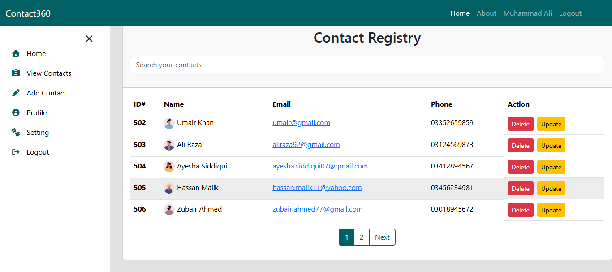  
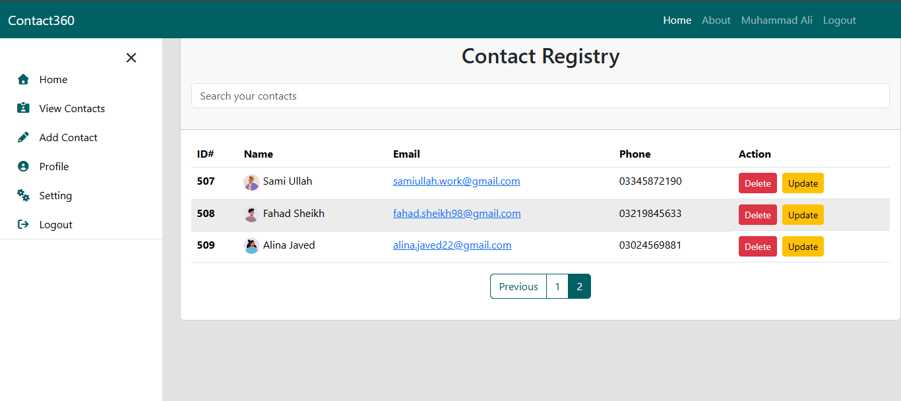

---

## ✏️ Edit / Update Contact  
Update any saved contact’s information and image.  
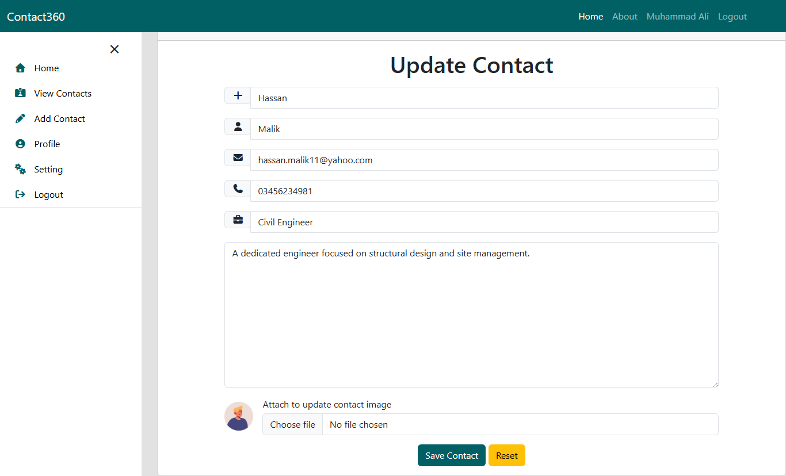

---

## 🗑 Delete Contact  
Delete a contact with a confirmation action.  

---

## 💳 Payment Gateway (Stripe Sandbox)
Users can make payments using Stripe in test mode. Payment details are saved in the system.  
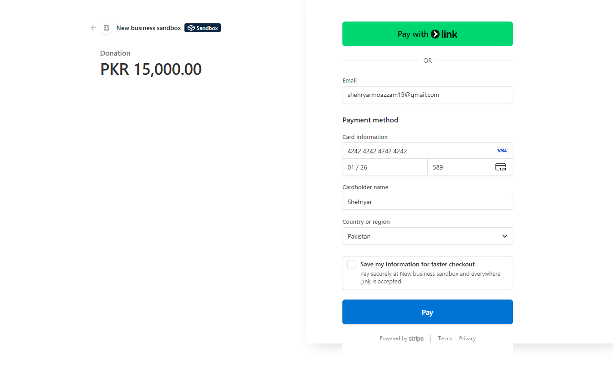  
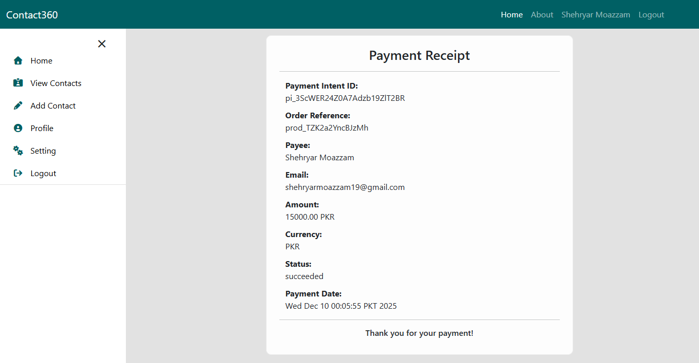 